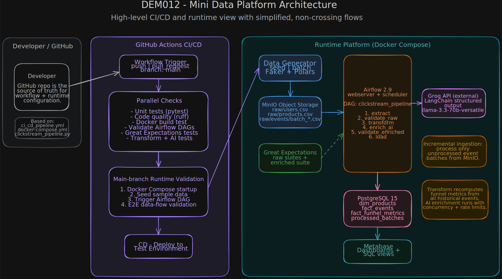
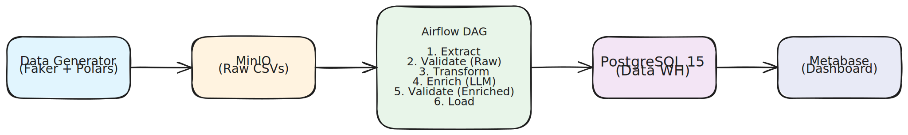

# DEM012 — Mini Data Platform: E-commerce Clickstream Analysis

A containerised data platform that ingests synthetic e-commerce clickstream events,
runs a multi-stage ETL pipeline (extraction → validation → transformation →
AI enrichment → load), and surfaces the results in a dashboard.

Supports **incremental ingestion**: the data generator produces timestamped batch files,
and the DAG processes only new/unprocessed batches while recalculating funnel metrics
from all accumulated data. AI enrichment uses **async concurrent LLM calls** with
semaphore-based rate limiting.

Built as a hands-on CI/CD automation exercise using GitHub Actions.

---

## Architecture

The platform is split into two cooperating layers: a **CI/CD layer** (GitHub Actions) that tests, validates, and deploys, and a **Runtime Platform** (Docker Compose) that ingests, processes, and serves clickstream data.

### Full Platform View


### Component Overview

| Layer | Component | Role |
|-------|-----------|------|
| **Ingestion** | `data_generator` | Produces synthetic e-commerce events using Faker + Polars in `seed` or `batch` mode |
| **Object Storage** | MinIO | S3-compatible store for raw CSV batches and dimension files |
| **Orchestration** | Apache Airflow 2.9 | Schedules and executes the 6-stage `clickstream_pipeline` DAG daily |
| **Validation** | Great Expectations | Runs schema + quality suites on raw and enriched data at pipeline checkpoints |
| **Transformation** | Polars | Sessionises events; recomputes full funnel metrics from all historical batches |
| **AI Enrichment** | LangChain + Groq | Async concurrent LLM calls with semaphore rate-limiting for product categorisation |
| **Data Warehouse** | PostgreSQL 15 | Houses dimension (`dim_products`) and fact (`fact_events`, `fact_funnel_metrics`) tables |
| **Dashboard** | Metabase | SQL-driven charts and tables served at `localhost:3000` |
| **CI/CD** | GitHub Actions | Parallel quality checks → Docker platform startup → E2E validation on every push/PR |



### Pipeline Tasks

| # | Task | Tools | What it does |
|---|------|-------|-------------|
| 1 | `extract` | MinIO, Polars | Scan `raw/events/` for batch files not yet in `processed_batches`. Download new batches + dimension tables. Short-circuits downstream if no new data. |
| 2 | `validate_raw` | Great Expectations | Per-batch GE suite: non-null IDs, valid event types, uniqueness constraints. |
| 3 | `transform` | Polars | Sessionise new events; read **all** batches from MinIO to recompute full funnel metrics from scratch. |
| 4 | `enrich_ai` | LangChain, Groq | `asyncio.gather` with `Semaphore(2)` + rate-gate throttling. Structured output via `init_chat_model("groq:llama-3.3-70b-versatile").with_structured_output(ProductCategory)`. |
| 5 | `validate_enriched` | Great Expectations | GE suite: `category` not-null, conversion rates in `[0, 1]`. |
| 6 | `load` | SQLAlchemy, PostgreSQL | Append new events → `fact_events`; full-refresh `dim_products` and `fact_funnel_metrics`; record batch keys in `processed_batches`. |

### Data Flow

> **Incremental by design** — the DAG processes only *new* batches each run, while funnel metrics are always recomputed from the full historical dataset.

| Data Type | Storage Path | Update Strategy |
|-----------|-------------|-----------------|
| Dimension tables (`users.csv`, `products.csv`) | `raw/` — uploaded once via `seed` mode | Full-refresh in PostgreSQL |
| Event batches | `raw/events/batch_YYYYMMDD_HHmmss.csv` | Appended to `fact_events`; only unprocessed batches fetched |
| Funnel metrics | Derived from all `fact_events` | Full-refresh `fact_funnel_metrics` on every run |


---

## Stack

| Layer | Technology |
|-------|-----------|
| Language | Python 3.11 |
| Package manager | [uv](https://docs.astral.sh/uv/) |
| Data processing | [Polars](https://pola.rs/) |
| Data validation | [Great Expectations](https://greatexpectations.io/) ≥ 0.18 |
| AI enrichment | [LangChain](https://python.langchain.com/) + Groq `llama-3.3-70b-versatile` (async) |
| Orchestration | Apache Airflow 2.9 (TaskFlow API) |
| Object storage | MinIO |
| Database | PostgreSQL 15 |
| Dashboard | Metabase |
| CI/CD | GitHub Actions |
| Containers | Docker Compose |

---

## Project Structure

```
.
├── .github/workflows/       # CI/CD pipeline (GitHub Actions)
├── dags/
│   ├── clickstream_pipeline.py   # Main Airflow DAG (6-stage ETL)
│   └── enrichment_logic.py       # Async LLM enrichment with rate limiting
├── data_generator/
│   └── generate_data.py          # Faker-based data generator (seed/batch modes)
├── docker/
│   └── airflow/Dockerfile        # Custom Airflow image
├── docs/screenshots/             # Dashboard and pipeline screenshots
├── great_expectations/
│   └── expectations/             # GE validation suites (JSON)
├── scripts/
│   └── validate_data_flow.py     # E2E data flow validation script
├── tests/                        # pytest test suite (83 tests)
├── docker-compose.yml            # Full platform definition
├── pyproject.toml                # Python project config
└── requirements.txt              # Airflow container dependencies
```

---

## Screenshots

### Pipeline Execution (Airflow)

| DAG Task Graph | Successful DAG Run |
|:-:|:-:|
|  |  |

### Data Storage (MinIO)


### Dashboards (Metabase)

| Metabase Home | Funnel Metrics Table |
|:-:|:-:|
|  |  |

| Conversion Rates Chart | Products by Category |
|:-:|:-:|
|  |  |

---

## Prerequisites

- Docker ≥ 24 with Docker Compose V2
- [uv](https://docs.astral.sh/uv/getting-started/installation/) ≥ 0.5
- A Groq API key (for the AI enrichment task)

---

## Quick Start

### 1 — Clone and configure environment

```bash
git clone <repo-url>
cd DEM012-CI-CD-Workflow-Automation-with-Github

cp .env.example .env
# Then open .env and fill in:
#   GROQ_API_KEY=gsk-...
#   AIRFLOW__CORE__FERNET_KEY=<run: rav x fernet-key>
#   AIRFLOW__WEBSERVER__SECRET_KEY=<random string>
```

### 2 — Install Python dependencies (local dev / testing)

```bash
uv sync
```

### 3 — Start the platform

```bash
docker compose up -d --build
```

Wait ~60 s for all services to become healthy:

```bash
docker compose ps   # all services should show "(healthy)"
```

### 4 — Generate and upload sample data

```bash
# Seed mode: uploads users, products, and initial events batch
rav x seed
# or: uv run python data_generator/generate_data.py --mode seed
```

This creates `raw/users.csv`, `raw/products.csv`, and a timestamped events batch
(`raw/events/batch_YYYYMMDD_HHmmss.csv`) in the MinIO bucket.

To add more events later (simulating ongoing data):

```bash
# Batch mode: generates one new timestamped events batch
rav x batch
# or: uv run python data_generator/generate_data.py --mode batch
```

Verify via the MinIO Console at **http://localhost:9001**.

### 5 — Trigger the pipeline

Open the Airflow UI at **http://localhost:8080** (admin / admin).

Either wait for the `@daily` schedule or trigger manually:

```bash
docker compose exec airflow-webserver airflow dags trigger clickstream_pipeline
```

The pipeline will:
1. Detect new event batches not yet processed
2. Validate, transform, enrich, and load them
3. Skip gracefully if no new batches exist

### 6 — Explore results in Metabase

1. Navigate to **http://localhost:3000**
2. Add a PostgreSQL database connection
3. Browse tables: `dim_products`, `fact_funnel_metrics`, `fact_events`

---

## Running Tests

```bash
uv run pytest tests/ -v
```

---

## Linting

```bash
uv run ruff check .
uv run ruff format .
```

---

## Environment Variables

| Variable | Description |
|----------|-------------|
| `GROQ_API_KEY` | Required for AI enrichment |
| `GROQ_MAX_CONCURRENT` | Max concurrent async LLM calls (default: `2`) |
| `GROQ_REQUESTS_PER_SECOND` | Max request pace (default: `0.8`) |
| `GROQ_MAX_ATTEMPTS` | Max retry attempts on rate-limit errors (default: `8`) |
| `BATCH_EVENT_COUNT` | Events per batch in batch mode (default: `500`) |
| `POSTGRES_USER/PASSWORD/DB` | PostgreSQL credentials |
| `MINIO_ROOT_USER/ROOT_PASSWORD` | MinIO access credentials |

---

## License

MIT
