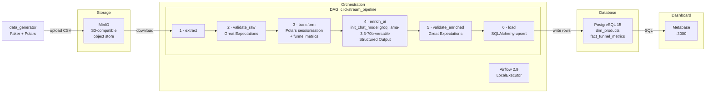

# DEM012 — Mini Data Platform: E-commerce Clickstream Analysis

A containerised data platform that ingests synthetic e-commerce clickstream events,
runs a multi-stage ETL pipeline (extraction → validation → transformation →
AI enrichment → load), and surfaces the results in a dashboard.

Built as a hands-on CI/CD automation exercise using GitHub Actions.

---

## Architecture



### Pipeline Tasks

| # | Task | What it does |
|---|------|-------------|
| 1 | `extract` | Download `users.csv`, `products.csv`, `events.csv` from MinIO to a temp dir |
| 2 | `validate_raw` | GE suite: non-null `user_id`/`product_id`/`event_type`, valid event-type enum |
| 3 | `transform` | Polars: 30-min session windows, per-product funnel counts & conversion rates |
| 4 | `enrich_ai` | `init_chat_model("groq:llama-3.3-70b-versatile", streaming=False).with_structured_output(ProductCategory)` with request pacing + exponential backoff on 429s |
| 5 | `validate_enriched` | GE suite: category not-null, conversion rates in [0, 1] |
| 6 | `load` | SQLAlchemy upserts into `dim_products` and `fact_funnel_metrics` |

---

## Stack

| Layer | Technology |
|-------|-----------|
| Language | Python 3.11 |
| Package manager | [uv](https://docs.astral.sh/uv/) |
| Data processing | [Polars](https://pola.rs/) |
| Data validation | [Great Expectations](https://greatexpectations.io/) ≥ 0.18 |
| AI enrichment | [LangChain](https://python.langchain.com/) + Groq `llama-3.3-70b-versatile` |
| Orchestration | Apache Airflow 2.9 (TaskFlow API) |
| Object storage | MinIO |
| Database | PostgreSQL 15 |
| Dashboard | Metabase |
| CI/CD | GitHub Actions |
| Containers | Docker Compose |

---

## Prerequisites

- Docker ≥ 24 with Docker Compose V2
- [uv](https://docs.astral.sh/uv/getting-started/installation/) ≥ 0.5
- A Groq API key (for the AI enrichment task)

---

## Quick Start

### 1 — Clone and configure environment

```bash
git clone <repo-url>
cd DEM012-CI-CD-Workflow-Automation-with-Github

cp .env.example .env
# Then open .env and fill in:
#   GROQ_API_KEY=gsk-...
#   AIRFLOW__CORE__FERNET_KEY=<run: python -c "from cryptography.fernet import Fernet; import sys; sys.stdout.write(Fernet.generate_key().decode())">
#   AIRFLOW__WEBSERVER__SECRET_KEY=<random string>
#   # Optional Groq rate-limit tuning:
#   GROQ_REQUESTS_PER_SECOND=1.5
#   GROQ_MAX_ATTEMPTS=8
#   GROQ_RETRY_BASE_SECONDS=2
#   GROQ_RETRY_MAX_SECONDS=30
```

### 2 — Install Python dependencies (local dev / testing)

```bash
uv sync
```

### 3 — Start the platform

```bash
docker compose up -d --build
```

Wait ~60 s for all services to become healthy:

```bash
docker compose ps   # all services should show "(healthy)"
```

### 4 — Generate and upload sample data

```bash
uv run python data_generator/generate_data.py
```

This creates and uploads `raw/users.csv`, `raw/products.csv`, `raw/events.csv`
to the `clickstream-data` MinIO bucket.

You can verify via the MinIO Console at **http://localhost:9001**
(login: `minioadmin` / `minioadmin` unless overridden in `.env`).

### 5 — Trigger the pipeline

Open the Airflow UI at **http://localhost:8080** (admin / admin).

Either wait for the `@daily` schedule or trigger manually:

```bash
# via Airflow CLI inside the container
docker compose exec airflow-webserver airflow dags trigger clickstream_pipeline
```

Or use the REST API:

```bash
curl -X POST http://localhost:8080/api/v1/dags/clickstream_pipeline/dagRuns \
  -H "Content-Type: application/json" \
  -u admin:admin \
  -d '{"dag_run_id": "manual__local_run"}'
```

Poll the run until it succeeds:

```bash
curl http://localhost:8080/api/v1/dags/clickstream_pipeline/dagRuns/manual__local_run \
  -u admin:admin | python -m json.tool | grep state
```

### Groq Rate-Limit Tuning (Optional)

The `enrich_ai` task now includes:
- Request pacing between calls
- Exponential backoff + jitter when Groq returns `429 Too Many Requests`

Defaults (if unset) are tuned in code:
- `GROQ_REQUESTS_PER_SECOND=1.5`
- `GROQ_MAX_ATTEMPTS=8`
- `GROQ_RETRY_BASE_SECONDS=2`
- `GROQ_RETRY_MAX_SECONDS=30`

If your account/model quota is tighter, lower `GROQ_REQUESTS_PER_SECOND` (for example `1.0` or `0.8`) in `.env`.

### 6 — Explore results in Metabase

1. Navigate to **http://localhost:3000**
2. Complete the Metabase setup wizard (choose "I'll add my data later" → skip, or connect directly).
3. Add a database connection:
   - **Type**: PostgreSQL
   - **Host**: `postgres`
   - **Port**: `5432`
   - **Database**: value of `POSTGRES_DB` in your `.env`
   - **Username / Password**: values of `POSTGRES_USER` / `POSTGRES_PASSWORD`
4. Browse **Browse Data → (your database)** to see:
   - `dim_products` — products with AI-assigned categories
   - `fact_funnel_metrics` — per-product conversion rates by session

### 7 — Add screenshots to documentation

Store screenshots under `docs/screenshots/` and update the placeholders:

- [Screenshot Asset Notes](docs/screenshots/README.md)
- [Dashboard Screenshot Placeholders](docs/screenshots/dashboard-screenshots.md)
- [Pipeline Screenshot Placeholders](docs/screenshots/pipeline-screenshots.md)

---

## Running Tests

Unit tests use Polars directly — no Docker required:

```bash
uv run pytest tests/ -v
```

16 tests covering funnel metric calculations, sessionisation logic, and data
generator output shapes.

---

## Linting

```bash
uv run ruff check .
uv run ruff format .
```

Pre-commit hooks run ruff automatically on every commit:

```bash
uv run pre-commit install   # one-time setup
```

---

## CI/CD Pipeline (GitHub Actions)

### `ci` job — runs on every push / pull request

| Step | What happens |
|------|-------------|
| Checkout | `actions/checkout` |
| Set up uv | `astral-sh/setup-uv` |
| Install deps | `uv sync` |
| Build image | `docker build -f docker/airflow/Dockerfile .` |
| Lint | `uv run ruff check .` |
| Test | `uv run pytest tests/ -v` |

### `cd` job — runs after `ci` succeeds on `main`

| Step | What happens |
|------|-------------|
| Start platform | `docker compose up -d` |
| Seed data | `uv run python data_generator/generate_data.py` |
| Trigger DAG | POST to Airflow REST API |
| Poll DAG | Wait until state = `success` (timeout 10 min) |
| Validate | `uv run python scripts/validate_data_flow.py` |
| Tear down | `docker compose down -v` |

> The `GROQ_API_KEY` is injected via a GitHub Actions **repository secret**.

---

## Project Structure

```
.
├── .github/
│   └── workflows/
│       └── ci_cd_pipeline.yml      # CI lint/test + CD E2E validation
├── dags/
│   └── clickstream_pipeline.py     # 6-task Airflow DAG
├── data_generator/
│   └── generate_data.py            # Faker + Polars + MinIO upload
├── docker/
│   └── airflow/
│       └── Dockerfile              # Custom Airflow image (uv-based deps)
├── docs/
│   └── screenshots/
│       ├── README.md               # Screenshot asset conventions
│       ├── dashboard-screenshots.md
│       └── pipeline-screenshots.md
├── great_expectations/
│   └── expectations/
│       ├── raw_events_suite.json
│       └── enriched_funnel_suite.json
├── scripts/
│   └── validate_data_flow.py       # E2E check: MinIO + Postgres + Metabase
├── tests/
│   └── test_transformations.py     # 16 unit tests (all passing)
├── .env.example                    # Environment variable template
├── .pre-commit-config.yaml         # ruff hooks
├── .python-version                 # 3.11
├── docker-compose.yml
├── pyproject.toml                  # uv project + ruff + pytest config
└── uv.lock
```

---

## Environment Variables

See [.env.example](.env.example) for the full list. Key variables:

| Variable | Description |
|----------|-------------|
| `GROQ_API_KEY` | Required for the AI enrichment task |
| `GROQ_REQUESTS_PER_SECOND` | Optional max request pace for AI enrichment (default: `1.5`) |
| `GROQ_MAX_ATTEMPTS` | Optional max attempts per product classification on rate-limit errors (default: `8`) |
| `GROQ_RETRY_BASE_SECONDS` | Optional initial backoff for 429 retries (default: `2`) |
| `GROQ_RETRY_MAX_SECONDS` | Optional cap for exponential backoff delay (default: `30`) |
| `POSTGRES_USER/PASSWORD/DB` | PostgreSQL credentials |
| `MINIO_ROOT_USER/ROOT_PASSWORD` | MinIO access credentials |
| `AIRFLOW__CORE__FERNET_KEY` | Airflow encryption key (generate once) |
| `AIRFLOW__WEBSERVER__SECRET_KEY` | Airflow web session key |

---

## License

MIT
